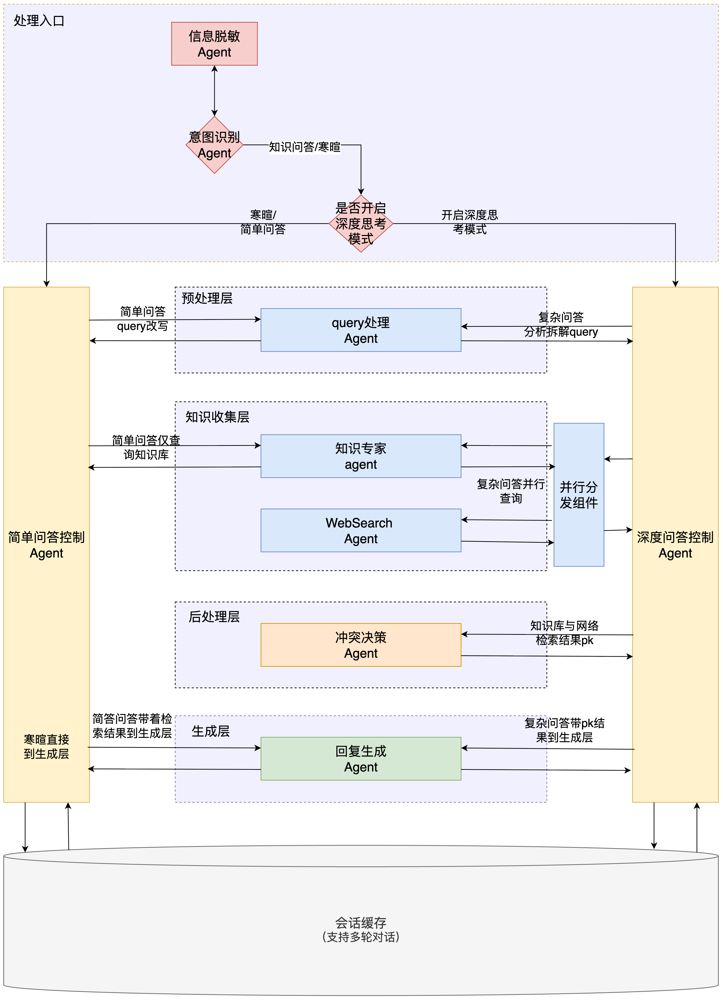
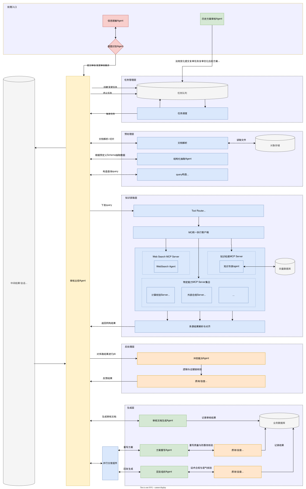

# MOTA 智能方案审核与知识问答系统 — 技术文档

> 版本：v2.0.0 | 更新日期：2026-05-07

---

## 1. 系统概述

MOTA 是一个基于**多智能体（Multi-Agent）架构**的智能化业务处理平台，核心功能包含：

- **知识问答（QA）**：支持多轮对话、深度思考、多源检索与冲突裁决
- **方案审核（Review）**：支持 PDF/DOCX 文档的全链路自动化合规审查与报告生成
- **知识库管理**：支持本地文件的向量化入库、增量同步与语义检索

系统采用分层架构：**前端展示层 → FastAPI 网关层 → LangGraph 工作流引擎 → 底层支撑（LLM / 向量库 / 任务队列）**。

---

## 2. 技术栈总览

### 2.1 后端

| 组件 | 技术选型 | 说明 |
|------|----------|------|
| Web 框架 | FastAPI | 提供 REST API 与 WebSocket |
| 工作流引擎 | LangGraph | 编排多 Agent 节点的有向图 |
| 大模型（LLM） | DeepSeek Chat（`deepseek-chat`） | 通过 OpenAI 兼容接口调用 |
| 向量数据库 | ChromaDB（本地持久化） | 存储路径：`backend/chroma_db/`，集合名：`mota_knowledge` |
| Embedding 模型 | Qwen3-Embedding-0.6B（vLLM 本地推理） | 模型路径：`/root/modelparams/Qwen3-Embedding-0.6B` |
| 网络检索 | DuckDuckGo Search | 可通过 `.env` 中 `WEB_SEARCH_ENABLED=false` 关闭 |
| 文档解析 | PyMuPDF（PDF）+ python-docx（DOCX） | |
| 异步任务 | 内存任务队列（`asyncio.Queue`） | 用于长耗时审核任务的异步提交与查询 |
| 会话管理 | 内存 SessionStore | 存储多轮对话历史，服务重启后清空 |

### 2.2 前端

| 版本 | 框架 | 用途 |
|------|------|------|
| `frontend-vue2/` | Vue 2 + Vuex + Vue Router | **当前主力前端**，集成 Mock 模式 |
| `frontend/` | Next.js 14 + TypeScript + Tailwind | 备用/实验版本，功能基本平行 |

前端开发代理：Vue2 前端（`:8080`）代理 `/api` 到后端（`:6006`）。

---

## 3. 项目目录结构

```
mota/
├── backend/
│   ├── app/
│   │   ├── main.py                  # FastAPI 入口，路由注册，启动预加载
│   │   ├── agents/                  # 各 Agent 实现
│   │   │   ├── base_agent.py
│   │   │   ├── desensitize_agent.py     # 信息脱敏
│   │   │   ├── intent_agent.py          # 意图识别
│   │   │   ├── query_processor_agent.py # Query 改写/拆解
│   │   │   ├── knowledge_expert_agent.py# 向量库检索
│   │   │   ├── web_search_agent.py      # 网络检索（DuckDuckGo）
│   │   │   ├── conflict_resolution_agent.py # 冲突裁决
│   │   │   ├── response_generator_agent.py  # 回复生成
│   │   │   ├── doc_parser_agent.py          # 文档解析
│   │   │   ├── struct_extract_agent.py      # 结构化抽取
│   │   │   ├── query_builder_agent.py       # 审核 Query 构造
│   │   │   ├── inquiry_agent.py             # 质询/自查
│   │   │   ├── review_doc_generator_agent.py# 审核报告生成
│   │   │   ├── plan_rewrite_agent.py        # 方案重写
│   │   │   ├── history_review_agent.py      # 历史记录检查
│   │   │   └── parallel_dispatcher.py       # 并行分发组件
│   │   ├── graph/                   # LangGraph 工作流
│   │   │   ├── qa_workflow.py       # 知识问答工作流
│   │   │   ├── qa_state.py          # QA 状态定义
│   │   │   ├── qa_nodes.py          # QA 节点函数
│   │   │   ├── review_workflow.py   # 方案审核工作流
│   │   │   ├── review_state.py      # 审核状态定义
│   │   │   ├── review_nodes.py      # 审核节点函数
│   │   │   ├── vectordb_workflow.py # 向量库操作工作流
│   │   │   ├── vectordb_state.py    # 向量库状态
│   │   │   └── vectordb_nodes.py    # 向量库节点
│   │   ├── core/                    # 基础能力
│   │   │   ├── config.py            # 配置（读取 .env）
│   │   │   ├── llm.py               # DeepSeek 客户端
│   │   │   ├── vector_store.py      # ChromaDB CRUD 封装
│   │   │   ├── embedding.py         # Embedding 模型加载
│   │   │   ├── embedding_function.py# ChromaDB 自定义 EmbeddingFunction
│   │   │   ├── parse_doc.py         # 文档解析工具
│   │   │   ├── search.py            # DuckDuckGo 搜索客户端
│   │   │   └── text_splitter.py     # 文本切片工具
│   │   ├── api/
│   │   │   └── websocket_handler.py # WebSocket 连接管理器
│   │   ├── session/
│   │   │   └── session_store.py     # 会话历史存储
│   │   └── task/
│   │       ├── task_models.py       # Task 数据模型
│   │       └── task_queue.py        # 异步任务队列
│   ├── knowledge_files/             # 知识库原始文件（待向量化）
│   ├── upload_files/                # 用户上传的待审核文件
│   ├── chroma_db/                   # ChromaDB 持久化数据（运行时生成）
│   ├── requirements.txt
│   └── .env                         # 环境变量（不提交到 Git）
├── frontend-vue2/                   # Vue 2 主力前端
│   ├── src/
│   │   ├── views/                   # 页面：First.vue / Home.vue / KnowledgeFiles.vue
│   │   ├── components/              # UI 组件
│   │   ├── api/index.js             # API 客户端（含 Mock 模式切换）
│   │   ├── store/                   # Vuex store
│   │   └── mock/                    # Mock 数据与服务
│   └── vue.config.js                # 开发代理配置（:8080 → :6006）
├── frontend/                        # Next.js 备用前端（TypeScript）
├── image/                           # 架构图（3 张）
└── 技术文档.md                       # 本文档
```

---

## 4. 架构设计说明（设计意图）

> 本章依据三张架构图，描述系统的**完整设计目标**。与第 6 章（实际实现）和第 10 章（差距分析）对照阅读，可完整理解"设计了什么 → 实现了什么 → 还差什么"。

---

### 4.1 全局架构设计


系统整体分为**前台接入、网关层、核心处理中枢（问答 + 审核）、底层基础设施**四大部分，构成从用户接入到结果输出的全链路闭环。

#### 用户接入与网关层

- **用户侧**：通过 Web 浏览器接入，支持两种协议：
  - HTTP：用于文件上传、历史记录拉取等请求-响应场景
  - WebSocket：用于实时语音与多轮对话的长连接场景
- **接入网关**：包含三个核心模块——**鉴权中心**（安全校验）、**API 网关**（统一流量入口）、**WebSocket 服务器**（管理长连接会话）

#### 前置路由与意图分发

请求进入系统后经历两道前置处理：

1. **信息脱敏 Agent**：作为全局前置过滤器，在任何业务逻辑执行前对请求中的 PII（手机号、身份证、公司名等敏感数据）进行识别与替换，流程结束后还原
2. **意图识别 Agent**：作为全局路由器，分析脱敏后的请求内容，将流量路由至两大核心子系统：
   - 识别为**知识问答/寒暄**意图 → 分发至知识问答子系统
   - 识别为**方案审核**意图 → 分发至方案审核子系统

#### 底层基础设施

| 组件 | 职责 |
|------|------|
| 对象存储（OSS/S3） | 存储用户上传的方案文件，供审核流程拉取 |
| 业务数据库 | 持久化审核结论、任务状态、历史审核记录 |
| 向量数据库 | 存储知识库 Embedding，支持语义检索（RAG） |
| 会话/中间结果缓存 | 存储多轮对话上下文和审核链路中间状态，支持长任务中断恢复 |
| 通知服务组件 | 任务完成后向离线/在线用户推送邮件或系统消息 |

---

### 4.2 知识问答子系统设计



该子系统专为处理知识咨询、寒暄及复杂技术/业务问答设计，采用**双轨控制流 + 四级流水线**架构。

#### 双轨控制模式

经意图识别确认为问答类请求后，系统判断是否开启**深度思考模式**：

- **简单问答控制 Agent**（简单轨）：处理寒暄或直接可从知识库回答的简单检索
- **深度问答控制 Agent**（深度轨）：处理需要逻辑推理、多路召回和冲突比对的复杂问题
- **寒暄直通**：意图为纯寒暄时，跳过所有中间层，直接穿透至生成层

#### 四级流水线

```
预处理层 → 知识收集层 → 后处理层 → 生成层
```

**预处理层 — Query 处理 Agent**
- 简单模式：对原始 Query 进行**改写**（语义规范化、消歧）
- 深度模式：对复杂问题进行**分析与拆解**，分解为多个可检索的子查询

**知识收集层**
- 简单模式：调用**知识专家 Agent** 对知识库（向量数据库）执行单路语义检索
- 深度模式：触发**并行分发组件**，同时并行调度：
  - **知识专家 Agent**：检索内部知识库（私有文档、规则库）
  - **WebSearch Agent**：执行外部网络检索（实时信息补充）

**后处理层（深度模式专有） — 冲突决策 Agent**
- 将知识库结果与网络检索结果进行 PK 与一致性分析
- 识别并消解信息冲突，输出可信度更高的综合结论

**生成层 — 回复生成 Agent**
- 寒暄：直接基于 LLM 能力生成自然回复
- 简单问答：结合知识库检索结果生成有据可依的回复
- 深度问答：结合冲突裁决后的综合结论生成高质量回复

#### 底层状态管理

**会话缓存**横跨所有四个层级，各节点在执行过程中与缓存进行双向读写，支持多轮对话的上下文持续传递。

---

### 4.3 方案审核子系统设计



该子系统面向长文本、多维度的合规性与质量审查，是系统中最复杂的异步处理流，由统一的**审核主控 Agent** 进行中心化协调。

#### 触发机制

两类触发源：
1. **用户主动提交**：用户上传方案文件并发起审核/变更审核需求
2. **系统自动触发**：**历史方案审核 Agent** 监控底层合规规则与底线变化，当规则更新时自动将相关历史方案推入复审队列

#### 任务管理层

因审核流程耗时较长，采用**异步任务队列机制**：
- 审核请求推入**任务队列**
- **任务调度器**适时取队列并触发执行
- 审核主控 Agent 全程监控任务的创建、状态变更与终止

#### 预处理层（文档结构化）

```
从对象存储拉取文件
  → 文档解析 + 切片（长图/长文分块）
  → 结构化提取 Agent（按预定义 Schema 抽取核心字段）
  → Query 构造 Agent（基于结构化数据生成检索与校验 Query 集）
```

#### 知识获取层（工具调用核心）

本层采用灵活的 **Tool-Calling 架构**，是系统能力扩展的核心区域：

```
审核主控 Agent 下发 Query
  → Tool Router Agent（决定调用哪些外部能力）
  → MC 统一执行客户端（统一调度中心）
  → 并行调用多个 MCP Server（Model Context Protocol）
```

**MCP Server 集合**（当前设计的能力清单）：

| MCP Server | 职责 |
|-----------|------|
| Web Search MCP | 执行外部网络检索，获取最新政策/规范信息 |
| 知识检索 MCP | 连接向量数据库，召回私有知识库内容 |
| 计算校验 Server | 金额核算、税率计算、汇率换算等数字类校验 |
| 外部合规 Server | REPSE 查询、企业资质核验、行业规范检索等 |

多路 MCP 工具返回结果后，经过**多源结果解析与对齐**处理，将异构数据标准化后返回主控。

#### 后处理层（逻辑与自查）

```
冲突决策 Agent（多路结果 PK，识别信息冲突，确定优先级）
  → 质询/自查 Agent（严格的逻辑与证据链核验，保障审核严谨性）
```

质询/自查 Agent 是审核质量的核心保障，确保最终结论有理有据、逻辑自洽。

#### 生成层（产出与重写）

**主路径 — 审核文档生成 Agent**
- 生成正式审核报告，写入业务数据库持久化

**不合规处理路径（通过并行分发组件分发）**
- **方案重写 Agent**：基于审核发现给出修订方案
  - 产出须经**质询/自查 Agent** 进行"重写质量与防篡改核验"
- **回复组织 Agent**：将审核结论转化为面向用户的话术和语气
  - 产出须经**质询/自查 Agent** 进行"话术合规与语气核验"

整个执行链路的所有**中间结果**均持续写入左侧的**中间结果/会话缓存**，防止长链路执行中断后状态丢失。

---

## 5. 核心工作流详解（实际实现）

### 5.1 知识问答工作流（QA Workflow）

**文件**：[backend/app/graph/qa_workflow.py](backend/app/graph/qa_workflow.py)

**状态对象**（`QAState`）完整字段：

```
query → desensitized_query → intent / deep_mode → processed_queries
→ knowledge_results / web_results → resolved_context → response
```

**节点流程图**：

```
[node_desensitize]
       ↓
[node_intent_recognize]
       ↓
[node_query_process]
       ↓
  deep_mode?
  ├─ False → [node_simple_qa]（仅查向量库）
  │               ↓
  │       [node_generate_response]
  │
  └─ True  → [node_deep_qa]（并行：向量库 + DuckDuckGo）
                  ↓
          [node_conflict_resolve]
                  ↓
          [node_generate_response]
```

**各节点职责**：

| 节点 | Agent | 功能 |
|------|-------|------|
| `node_desensitize` | `DesensitizeAgent` | 正则/规则识别 PII，替换为占位符，保存还原映射表 |
| `node_intent_recognize` | `IntentAgent` | 分类为 `knowledge_qa` / `chitchat`，判断是否需要深度模式 |
| `node_query_process` | `QueryProcessorAgent` | 简单模式→改写，深度模式→拆解为多个子查询 |
| `node_simple_qa` | `KnowledgeExpertAgent` | 对每个子查询检索 ChromaDB，合并结果 |
| `node_deep_qa` | `KnowledgeExpertAgent` + `WebSearchAgent` | 顺序执行知识库检索和网络检索（注：当前实现为顺序而非真并行） |
| `node_conflict_resolve` | `ConflictResolutionAgent` | 对多源结果进行一致性分析与裁决，输出 `resolved_context` |
| `node_generate_response` | `ResponseGeneratorAgent` | 结合 context 调用 DeepSeek 生成回复，最后还原脱敏占位符 |

---

### 5.2 方案审核工作流（Review Workflow）

**文件**：[backend/app/graph/review_workflow.py](backend/app/graph/review_workflow.py)

**节点流程图**：

```
[node_desensitize]
       ↓
[node_check_history]
       ↓
  has_history && !has_policy_change?
  ├─ True  → [node_generate_review]（复用历史，跳过完整审核）
  └─ False → [node_parse_document]
                  ↓
           [node_struct_extract]
                  ↓
           [node_build_queries]
                  ↓
           [node_multi_source_search]
                  ↓
           [node_conflict_resolve]
                  ↓
           [node_inquiry_check]（质询/自查）
                  ↓
           [node_generate_review]
```

**各节点职责**：

| 节点 | Agent | 功能 |
|------|-------|------|
| `node_desensitize` | `DesensitizeAgent` | 同 QA 流程 |
| `node_check_history` | `HistoryReviewAgent` | 查询是否有历史审核记录，检测政策变化 |
| `node_parse_document` | `DocParserAgent` | 从 `upload_files/` 解析 PDF/DOCX 文本，提取元信息 |
| `node_struct_extract` | `StructExtractAgent` | 按预定义 Schema 从文档中抽取结构化字段 |
| `node_build_queries` | `QueryBuilderAgent` | 根据结构化数据构造审核检索 query 和维度列表 |
| `node_multi_source_search` | `KnowledgeExpertAgent` + `WebSearchAgent` | 多源检索支撑材料 |
| `node_conflict_resolve` | `ConflictResolutionAgent` | 多源信息裁决 |
| `node_inquiry_check` | `InquiryAgent` | 逻辑与证据链核验（自查反思） |
| `node_generate_review` | `ReviewDocGeneratorAgent` + `PlanRewriteAgent` | 生成审核报告，必要时输出重写建议 |

---

### 5.3 向量库操作工作流（VectorDB Workflow）

**文件**：[backend/app/graph/vectordb_workflow.py](backend/app/graph/vectordb_workflow.py)

支持操作（`operation` 字段切换）：`add` / `search` / `qa` / `update` / `delete` / `get_all`

**知识库入库流程（`add`）**：

```
读取文件 → 文档解析（PyMuPDF/python-docx）→ 文本切片（text_splitter）
→ Qwen3 Embedding → ChromaDB upsert（以 file_id 为主键）
```

---

## 6. API 接口清单

后端服务运行于 `http://0.0.0.0:6006`

### 6.1 核心业务接口

| 方法 | 路径 | 功能 |
|------|------|------|
| POST | `/api/chat` | 知识问答（同步，返回完整响应） |
| POST | `/api/chat/stream` | 知识问答（SSE 流式，逐步推送步骤） |
| POST | `/api/review` | 方案审核（同步，耗时较长） |
| POST | `/api/upload` | 上传待审核文件（PDF/DOCX/TXT） |
| POST | `/api/knowledge_upload` | 上传知识库文件 |

### 6.2 任务管理接口（异步审核）

| 方法 | 路径 | 功能 |
|------|------|------|
| POST | `/api/task/submit` | 提交异步审核任务，返回 `task_id` |
| GET | `/api/task/{task_id}` | 查询任务状态和步骤 |
| GET | `/api/tasks` | 列出任务（支持按 `session_id` 过滤） |

### 6.3 知识库管理接口

| 方法 | 路径 | 功能 |
|------|------|------|
| POST | `/api/knowledge/batch_import` | 增量同步 `knowledge_files/` 到向量库（新增/跳过/清理） |
| GET | `/api/knowledge/scan` | 扫描可导入文件列表 |
| GET | `/api/knowledge/tree` | 按目录树形返回知识库文件 |
| GET | `/api/knowledge/download` | 下载知识库文件 |
| GET | `/api/knowledge/preview` | 在浏览器内联预览文件（PDF/TXT） |

### 6.4 向量库 CRUD 接口

| 方法 | 路径 | 功能 |
|------|------|------|
| POST | `/api/vectordb/add` | 添加单个文档到向量库 |
| POST | `/api/vectordb/search` | 语义搜索（返回 top-k 相关片段） |
| POST | `/api/vectordb/qa` | 向量库直接问答 |
| POST | `/api/vectordb/update` | 更新文档 |
| POST | `/api/vectordb/delete` | 删除文档（按 ID 或 filter） |
| GET | `/api/vectordb/list` | 列出向量库文档 |

### 6.5 其他

| 方法 | 路径 | 功能 |
|------|------|------|
| GET | `/api/health` | 健康检查 |
| WebSocket | `/ws/{session_id}` | 实时推送 Agent 执行步骤（支持 ping/pong、chat 消息） |

---

## 7. 关键配置说明

### 7.1 环境变量（`.env`）

```ini
# DeepSeek LLM
DEEPSEEK_API_KEY=sk-xxxx
DEEPSEEK_API_BASE=https://api.deepseek.com/v1
DEEPSEEK_MODEL=deepseek-chat

# 网络检索
SEARCH_ENGINE=duckduckgo
SEARCH_MAX_RESULTS=5
WEB_SEARCH_ENABLED=true          # 改为 false 可关闭网络检索

# ChromaDB
CHROMA_DB_PATH=./chroma_db
CHROMA_COLLECTION_NAME=mota_knowledge

# Embedding（本地 vLLM）
EMBEDDING_MODEL_TYPE=vllm
MODEL_BASE_DIR=/root/modelparams  # 本地模型存放根目录
EMBEDDING_MODEL_NAME=Qwen3-Embedding-0.6B
EMBEDDING_DEVICE=cuda             # CPU 机器改为 cpu
```

> **注意**：`.env` 文件包含 API 密钥，禁止提交到 Git。

### 7.2 启动预加载机制

`main.py` 中 `startup_preload()` 事件在服务启动时会：
1. 强制设置 `HF_HUB_OFFLINE=1` / `TRANSFORMERS_OFFLINE=1`（禁止联网下载模型）
2. 从本地路径加载 Qwen3 Embedding 模型
3. 预初始化所有 QA Agent 实例（避免首次请求冷启动延迟）
4. 预初始化所有 Review Agent 实例

---

## 8. 本地开发快速启动

### 8.1 后端

```bash
cd backend
pip install -r requirements.txt

# 配置环境变量
cp .env.example .env
# 编辑 .env，填写 DEEPSEEK_API_KEY 和本地模型路径

# 启动服务（端口 6006）
python app/main.py
# 或
uvicorn app.main:app --host 0.0.0.0 --port 6006 --reload
```

### 8.2 Vue2 前端（主力）

```bash
cd frontend-vue2
npm install
npm run serve   # 启动开发服务器（端口 8080）
```

访问 `http://localhost:8080`，API 请求自动代理至 `http://localhost:6006`。

### 8.3 知识库初始化

```bash
# 将知识文档放入 backend/knowledge_files/ 目录（支持子目录分类）
# 调用批量导入接口
curl -X POST http://localhost:6006/api/knowledge/batch_import \
  -H "Content-Type: application/json" \
  -d '{"category": "law", "permissions": 0}'
```

---

## 9. 当前实现状态（已完成 / 待完善）

### 9.1 已完整实现

- [x] 知识问答完整流程（脱敏 → 意图 → Query处理 → 检索 → 裁决 → 生成）
- [x] 方案审核完整流程（脱敏 → 历史检查 → 文档解析 → 结构化 → 多源检索 → 质询 → 报告）
- [x] ChromaDB 向量库完整 CRUD + 增量同步
- [x] DeepSeek Chat API 接入（同步 + 异步封装）
- [x] Qwen3-Embedding-0.6B 本地推理（vLLM 后端）
- [x] DuckDuckGo 网络检索（可关闭）
- [x] WebSocket 实时步骤推送
- [x] SSE 流式响应接口
- [x] 异步任务队列（提交 + 状态轮询）
- [x] 多轮对话历史管理（内存 SessionStore）
- [x] 知识库文件浏览、下载、预览接口
- [x] Vue2 前端：聊天界面、方案审核面板、知识库管理、Agent 思考过程展示
- [x] Mock 模式（前端可独立运行，无需后端）

### 9.2 已知问题 / 待完善

- [ ] **[Bug] 任务队列 Worker 从未启动**：`/api/task/submit` 可以接收任务，但 `task_queue.start_worker()` 未在 `main.py` 中调用，所有异步任务永久停留在 PENDING 状态，异步审核功能实际不可用
- [ ] **结构化提取 Schema 硬编码且文档截断**：`StructExtractAgent` 使用固定的 9 字段通用 Schema，`node_struct_extract` 不传自定义 schema；文档超 6000 字符直接截断，长文档后半段内容（财务条款、尾部风险点等）无法提取，影响后续 Query 构造和审核报告质量
- [ ] **方案重写未使用结构化提取结果**：`node_generate_review` 调用 `PlanRewriteAgent` 时只传入了原文截断和裁决结论，未传入 `state["structured_data"]`，重写建议无法针对具体提取字段（如法规名称、财务数据项）给出有针对性的修改意见
- [ ] **深度检索为顺序执行**：`node_deep_qa` 和 `node_multi_source_search` 中知识库与网络检索是两个 for 循环顺序执行；`parallel_dispatcher.py` 已实现 `asyncio.gather` 真并行但未被集成
- [ ] **意图识别不覆盖审核路由**：`IntentAgent` 只分类 `knowledge_qa` / `chitchat`，`document_review` 意图未实现，QA 与 Review 依赖前端调用不同接口来区分
- [ ] **历史审核检查为桩代码**：`HistoryReviewAgent.check_history()` 有 `# TODO` 注释，硬编码永远返回无历史记录
- [ ] **审核报告不持久化**：`review_report` 仅在内存中，无业务数据库存储
- [ ] **SessionStore / TaskQueue 为纯内存实现**：服务重启后会话历史和任务状态全部丢失
- [ ] **无 API 鉴权**：所有接口完全开放，生产部署前必须添加认证
- [ ] **CORS 仅允许 localhost**：部署时需更新白名单
- [ ] **旧版 `workflow.py` / `nodes.py` 未清理**：含硬编码 mock，已被新 `qa_workflow.py` 完全替代，可删除

---

## 10. 架构设计 vs 实际实现差距分析

> 本章对照第 4 章架构设计意图，逐条核查代码中的实际状态。
> 符号说明：✅ 已实现 | ⚠️ 部分实现 | ❌ 未实现（仅有桩代码或完全缺失）

### 10.1 全局架构（图1）差距

| 设计模块 | 状态 | 说明 |
|----------|------|------|
| Web 浏览器接入 | ✅ | Vue2 前端已实现 |
| HTTP 上传/历史拉取 | ✅ | `/api/upload`、`/api/tasks` 等已实现 |
| WebSocket 实时对话 | ✅ | `/ws/{session_id}` 已实现，支持 chat/步骤推送 |
| **鉴权中心** | ❌ | FastAPI 无任何鉴权中间件，所有接口完全开放 |
| **API 网关（独立网关层）** | ❌ | FastAPI 直接对外暴露，无统一网关（Nginx/Kong 等） |
| 信息脱敏 Agent（全局前置） | ⚠️ | QA 和 Review 工作流各自有 `node_desensitize`，但不是统一的网关前置拦截，而是工作流内节点 |
| 意图识别 Agent（统一路由） | ⚠️ | `IntentAgent` 已实现分类逻辑（`knowledge_qa` / `chitchat`），但**不负责路由到"方案审核"**——QA 与 Review 是两个独立 API 端点（`/api/chat` vs `/api/review`），由前端决定调用哪个，不存在统一意图路由到两个子系统 |
| 任务队列 + 任务调度 | ⚠️ | 内存队列已实现（`task_queue.py`），但 `start_worker` **从未在 `main.py` 中启动**，任务提交后实际不会被消费执行 |
| **历史方案 Agent 自动触发复审** | ❌ | `HistoryReviewAgent` 有代码骨架，但 `check_history()` 硬编码返回 `has_history=False`，无任何定时任务或事件触发复审机制 |
| **对象存储（OSS/S3）** | ❌ | 文件存储为本地磁盘（`upload_files/` / `knowledge_files/`），无对象存储集成 |
| 向量数据库 | ✅ | ChromaDB 本地持久化已实现 |
| 业务数据库 | ❌ | 无业务数据库，审核报告仅作为文本返回，不持久化存储 |
| **会话/中间结果缓存（Redis）** | ❌ | `SessionStore` 和 `TaskQueue` 均为纯内存实现，服务重启后全部丢失 |
| **通知模块（邮件推送）** | ❌ | 代码中完全无邮件或系统通知相关实现 |

---

### 10.2 知识问答系统（图2）差距

| 设计节点 | 状态 | 说明 |
|----------|------|------|
| 信息脱敏 → 意图识别 | ✅ | 已实现 `node_desensitize` → `node_intent_recognize` |
| 深度思考模式判定 | ✅ | `intent_agent` 用 LLM 分类，降级时用关键词规则（"详细"、"分析"等） |
| 寒暄直穿生成层 | ✅ | `qa_workflow.py` 中 `chitchat` → 直接跳至 `generate_response`，已实现 |
| 简单问答控制 Agent | ✅ | `node_simple_qa` → 仅查向量库 |
| 深度问答控制 Agent | ✅ | `node_deep_qa` → 知识库 + 网络 |
| **并行分发组件（真并行）** | ❌ | `parallel_dispatcher.py` 已实现 `asyncio.gather` 异步并行，但 **`node_deep_qa` 中未调用它**，而是直接用两个 for 循环顺序执行，不是并行 |
| Query 改写（简单模式） | ✅ | `query_processor_agent` 调用 LLM 改写 |
| Query 拆解（深度模式） | ✅ | `query_processor_agent` 调用 LLM 分解为子查询列表 |
| 知识专家 Agent（向量库检索） | ✅ | ChromaDB 语义检索已实现 |
| WebSearch Agent（网络检索） | ✅ | DuckDuckGo 检索已实现，可通过配置关闭 |
| 冲突决策 Agent | ✅ | `conflict_resolution_agent` 调用 LLM 裁决多源结果 |
| 回复生成 Agent | ✅ | `response_generator_agent` 调用 DeepSeek 生成，含 PII 还原 |
| **会话缓存双向读写（各 Agent 节点级）** | ⚠️ | `SessionStore` 仅在 API 层（`main.py`）的请求前后读写一次，各 Agent 节点内部不会主动访问缓存；多轮历史通过 `QAState.history` 字段在工作流启动时一次性注入 |

---

### 10.3 方案审核系统（图3）差距

| 设计节点 | 状态 | 说明 |
|----------|------|------|
| 审核主控 Agent（中心化协调） | ⚠️ | LangGraph StateGraph 承担了状态流转协调的角色，但无独立的"主控 Agent"对象，协调逻辑分散在工作流边和节点函数中 |
| 任务队列 + 任务调度 | ⚠️ | `task_queue.py` 代码已有，但 **`task_queue.start_worker()` 从未被调用**（`main.py` 中无启动），异步任务提交后实际处于 PENDING 状态不会执行 |
| 信息脱敏 | ✅ | 已实现 |
| 历史方案检查 | ⚠️ | 节点框架存在，`HistoryReviewAgent.check_history()` 有 `# TODO` 注释，硬编码永远返回无历史、执行完整审核 |
| 文档解析 + 切片 | ✅ | `DocParserAgent` 支持 PDF/DOCX 解析，`text_splitter` 已实现切片 |
| 结构化提取 Agent | ⚠️ | 框架已实现，但 Schema 在代码中硬编码为 9 个通用字段（公司名称、法规、风险点等），`node_struct_extract` 调用时未传入自定义 schema，无法按业务场景配置；此外文档超过 6000 字符时直接截断，长文档后半段内容（如详细财务条款、尾部风险说明）无法被提取 |
| Query 构造 Agent | ✅ | 根据结构化数据生成审核 query 和维度，有降级规则兜底 |
| **Tool Router Agent** | ❌ | 设计中的工具路由层完全未实现，`node_multi_source_search` 直接调用知识库 Agent 和网络 Agent，无工具选择路由逻辑 |
| **MC 统一执行客户端 / MCP 协议** | ❌ | 代码中无任何 MCP Server 实现，`web_search_agent` 和 `knowledge_expert_agent` 均为直接 Python 调用，不是 MCP 协议封装 |
| **计算校验 MCP Server（金额/税率）** | ❌ | 未实现 |
| **外部合规 MCP Server（REPSE/资质）** | ❌ | 未实现 |
| 多源检索（知识库 + 网络） | ✅ | `node_multi_source_search` 已实现（顺序执行） |
| 多源结果解析与对齐 | ✅ | `conflict_resolution_agent` 承担此职责 |
| 冲突决策 Agent | ✅ | 已实现 |
| 质询/自查 Agent | ✅ | `InquiryAgent.self_check()` 已实现，调用 LLM 进行质量评分 |
| 审核文档生成 Agent | ✅ | `ReviewDocGeneratorAgent` 已实现，调用 LLM 生成报告文本 |
| **审核结果写入业务数据库** | ❌ | `review_report` 仅存在 `ReviewState` 内存对象中，直接返回给前端，不持久化到任何数据库 |
| 方案重写 Agent | ⚠️ | `PlanRewriteAgent.rewrite()` 已实现，但 `node_generate_review` 调用时只传入了 `doc_text[:3000]` 和 `resolved_context`，**没有传入 `structured_data`**；重写建议无法基于已提取的结构化字段（如具体法规条款、财务数据项）给出有针对性的修改意见，输出精准度受限 |
| **方案重写防篡改核验（二次自查）** | ❌ | 重写结果直接作为字段存入 state，`inquiry_agent` 仅在 `node_inquiry_check` 对审核草稿做一次自查，对重写产出**没有二次核验** |
| **回复组织 Agent（独立节点）** | ❌ | 设计中是独立节点，实际代码中 `node_generate_review` 末尾将 `review_report` 直接赋值给 `response`，无独立的话术组织节点 |
| **回复话术合规核验（自查 Agent）** | ❌ | 同上，话术输出前无二次质询/自查 |
| 中间结果缓存持久化 | ❌ | 审核链路的中间结果仅存在 `ReviewState` dict 中，进程退出即丢失；设计中要求持久化到缓存（Redis 等）以防长链路中断 |

---

### 10.4 差距汇总

**按优先级分类的未实现项：**

**关键缺陷（影响核心功能正确性）**

1. **任务队列 Worker 未启动**：`/api/task/submit` 接口虽然可以接收任务，但后台消费者 `start_worker()` 从未被 `main.py` 调用，所有异步任务永久停留在 PENDING 状态。这是现有代码的 **Bug**，需立即修复。

2. **意图识别不路由审核任务**：`IntentAgent` 只识别 `knowledge_qa` / `chitchat`，不包含 `document_review` 意图路由。QA 与 Review 完全依赖前端选择调用不同接口，与架构图中"统一意图路由"设计不符。

3. **结构化提取 Schema 固化 + 长文档截断**：`StructExtractAgent` 硬编码 9 字段通用 Schema，文档超 6000 字符后直接截断，导致长文档的财务条款、尾部风险点等关键信息无法被提取，进而影响后续 Query 构造和审核报告的准确性。

4. **方案重写与结构化提取结果断路**：`node_generate_review` 调用 `PlanRewriteAgent` 时未传入 `structured_data`，重写建议只能基于原文截断和检索裁决结论，无法结合已提取的具体字段（法规名称、财务数据项等）给出有针对性的修改意见。

**架构层面缺失（需专项开发）**

3. **MCP Server / Tool Router 层**：方案审核系统的工具调用能力扩展框架完全未建立。计算校验、外部合规查询等垂直能力均无落地。
4. **业务数据库**：审核结论不持久化，无法支持历史查询、复审和合规审计。
5. **历史方案自动复审机制**：`HistoryReviewAgent` 是桩代码，没有定时任务/事件驱动的复审触发。
6. **通知模块**：无任何邮件/消息推送能力。

**生产化缺失（需基础设施改造）**

7. API 鉴权中间件
8. Session / Task 持久化（Redis）
9. 文件存储对象化（OSS/S3）
10. 网关层（Nginx 反向代理、限流）

---

## 11. 后续开发路径建议

### P0 — 立即修复（现有 Bug / 功能不通）

1. **修复任务队列 Worker 未启动**：在 `main.py` 的 `startup_preload` 事件中调用 `asyncio.create_task(task_queue.start_worker(review_handler))`，使 `/api/task/submit` 提交的审核任务能真正被消费执行。
   - 涉及文件：[backend/app/main.py](backend/app/main.py)、[backend/app/task/task_queue.py](backend/app/task/task_queue.py)

2. **真并行深度检索**：将 `node_deep_qa` 和 `node_multi_source_search` 中的两个顺序 for 循环改为调用现有的 `ParallelDispatcher.dispatch()`，直接用 `asyncio.gather` 并行执行知识库和网络检索。
   - 涉及文件：[backend/app/graph/qa_nodes.py](backend/app/graph/qa_nodes.py)、[backend/app/graph/review_nodes.py](backend/app/graph/review_nodes.py)、[backend/app/agents/parallel_dispatcher.py](backend/app/agents/parallel_dispatcher.py)

3. **结构化提取支持自定义 Schema + 分段提取**：
   - `/api/review` 接口新增可选参数 `schema: dict`，向下透传至 `node_struct_extract → struct_extract_agent.extract()`
   - 文档长度超过 6000 字符时，按已有的 `text_splitter` 切片逐段提取后合并，替代当前直接截断的做法
   - 涉及文件：[backend/app/agents/struct_extract_agent.py](backend/app/agents/struct_extract_agent.py)、[backend/app/graph/review_nodes.py](backend/app/graph/review_nodes.py)、[backend/app/main.py](backend/app/main.py)

4. **方案重写补充结构化数据**：在 `node_generate_review` 中将 `state["structured_data"]` 传入 `plan_rewrite_agent.rewrite()`，使重写建议能够针对已提取的具体字段（如"涉及法规 X 的第 Y 条，建议修改为…"）。
   - 涉及文件：[backend/app/graph/review_nodes.py](backend/app/graph/review_nodes.py)、[backend/app/agents/plan_rewrite_agent.py](backend/app/agents/plan_rewrite_agent.py)

### P1 — 近期补齐（影响生产可用性）

3. **Session & Task 持久化**：将 `SessionStore` 和 `TaskQueue` 的内存存储替换为 Redis，支持多实例部署和服务重启后恢复。TTL、最大历史轮数等参数已在现有 `SessionStore` 中定义，只需替换底层存储即可。

4. **业务数据库接入**：选型 PostgreSQL 或 MySQL，在 `node_generate_review` 生成审核报告后将结果写库；`HistoryReviewAgent.check_history()` 从数据库按文档指纹查历史记录，替换当前的硬编码 TODO。

5. **API 鉴权中间件**：在 FastAPI 中添加 `HTTPBearer` 或 JWT 验证依赖，保护所有 `/api/*` 路由；更新 CORS 白名单以匹配部署域名。

6. **意图识别纳入审核路由**：在 `IntentAgent.classify()` 中增加 `document_review` 意图分类，在 `/api/chat` 接口内根据意图自动路由到审核工作流，实现与架构图一致的统一入口。

### P2 — 中期建设（完善架构设计目标）

7. **MCP Server 框架**：抽象统一的 `ToolRouterAgent` 和 `MCPClient` 接口层，现有的 `WebSearchAgent` 和 `KnowledgeExpertAgent` 作为首批 MCP Server 注册；后续可扩展接入：
   - 计算校验 Server（金额、税率、汇率核算）
   - 外部合规 Server（REPSE/资质查询、行业规范 API）

8. **生成层完善**：拆分 `node_generate_review` 为独立的"审核报告生成 → 方案重写 → 话术组织"三个节点，每个节点都经过 `InquiryAgent` 二次自查核验，对齐架构图3的防篡改设计。

9. **历史复审自动触发**：实现定时任务（如 APScheduler）或规则变更事件驱动，当知识库规则更新时自动将历史相关方案推入复审队列。

10. **通知模块**：集成邮件服务（SMTP / SendGrid），在异步审核任务完成后推送通知；WebSocket 已支持在线用户的实时推送。

### P3 — 体验与运维优化

11. **审核进度流式推送**：`/api/review` 当前为同步阻塞，改造为异步提交 + WebSocket 实时步骤推送，前端 `AgentWorkflow` 组件已具备接收步骤的能力。

12. **审核报告结构化输出**：将 `review_report` 从纯文本改为结构化 JSON（包含评分、合规维度、问题列表、建议列表），前端渲染为可视化审核卡片。

13. **文件存储对象化**：将 `upload_files/` 和 `knowledge_files/` 替换为 OSS/S3，配置化存储路径，支持文件版本管理和大规模存储。

14. **前端技术栈统一**：选择 Vue2 或 Next.js 作为长期维护版本，清理另一套，避免双栈维护负担。

---

## 12. 运维与部署注意事项

### Embedding 模型

- 模型必须提前下载到 `MODEL_BASE_DIR`（默认 `/root/modelparams/Qwen3-Embedding-0.6B`）
- 服务启动时强制离线模式（`HF_HUB_OFFLINE=1`），不会尝试从 HuggingFace Hub 拉取
- CPU 环境需将 `EMBEDDING_DEVICE` 改为 `cpu`，并从 `requirements.txt` 中移除 `vllm` 和 `torch`（或替换为 CPU 版本）

### ChromaDB

- 数据持久化在 `backend/chroma_db/`，目录随服务器迁移
- 生产环境建议挂载持久化存储卷或迁移至独立的 Chroma 服务端

### 文件存储

- 待审核文件存于 `backend/upload_files/`，知识库文件存于 `backend/knowledge_files/`
- 生产环境建议替换为对象存储（OSS/S3），路径配置化

### 日志

- 后端使用 Python 标准 `logging`，格式：`时间 [级别] logger名 - 消息`
- 节点执行日志通过 `[QA]` / `[Review]` 前缀区分，便于过滤排查
